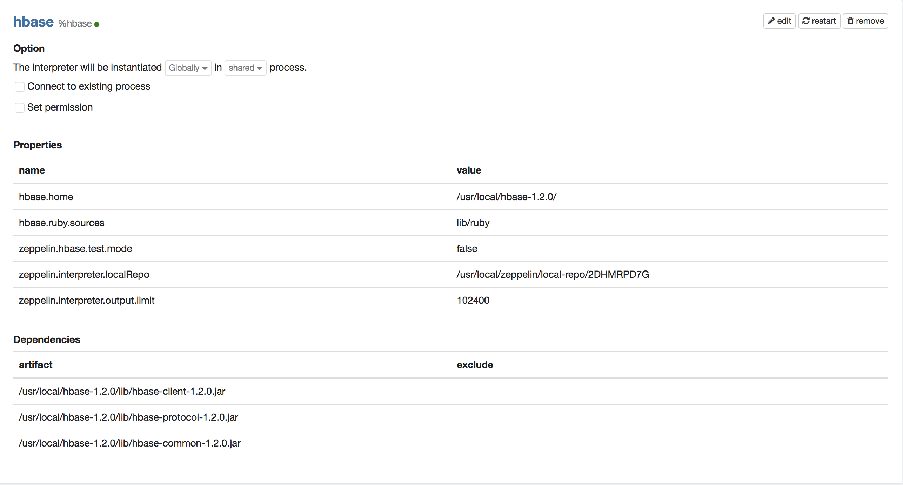

# About

This is a guide on local installation of Apache-zeppelin and configuration of its Hbase interpreter on **MacOS** (Version 10.13.1). 

# Dependencies

* Homebrew 
* Java8
* Hadoop
* Hbase 
* Apache-zeppelin 

# Versions 

* Java **1.8.0_172**
* Hadoop **2.7.6**
* Hbase **1.2.0**
* Apache-zeppelin **0.7.3**

# Install Homebrew 

1. Copy and paste this command into Terminal: 

	```
	$ /usr/bin/ruby -e "$(curl -fsSL https://raw.githubusercontent.com/Homebrew/install/master/install)"
	```


# Install Java 8 

1. Copy and paste these commands into Terminal (Zeppelin 0.7.3 only supports Java <= 8): 

	```
	brew tap caskroom/versions
	brew cask install java8
	export JAVA_HOME=`/usr/libexec/java_home -v 1.8`
	```

# Install Hadoop
1. Download a stable release from [Apache Hadoop Releases](http://hadoop.apache.org/releases.html).

2. Unpack it on your local file system, e.g. /usr/local/...

3. Put Hadoop Binary on the shell path: 

	```
	export HADOOP_HOME=/usr/local/hadoop-x.y.z
	export PATH=$PATH:$HADOOP_HOME/bin:$HADOOP_HOME/sbin
	```

4. Use "hadoop version" to verify hadoop has been installed 

	``` 
	hadoop version
	```

# Install Hbase 

1. Download a stable release from [Apache Download Mirror](http://www.apache.org/dyn/closer.cgi/hbase/).

2. Unpack it on your local file system, e.g. /usr/local/...

3. Specifying **JAVA_HOME** variable in Hbase's **conf/hbase-env.sh** file. e.g.
	
	```
	export JAVA_HOME=/Library/Java/JavaVirtualMachines/jdk1.7.0_25.jdk/Contents/Home
	```
4. Run Hbase Shell. 

	``` 
	cd /usr/local/hbase
	./bin/start-hbase.sh
	cd bin
	./hbase shell 
	```
5. Run simple instructions such as creating a table to see if it works. 

	```
	create 'table', 'col1', 'col2'
	```
	
# Install Apache-zeppelin 

1. Download the binary package with all interpreters from [Apache Zeppelin](https://zeppelin.apache.org/download.html)

2. Unpack it on your local file system, e.g. /usr/local/...

3. Start zeppelin

	```
	cd /usr/local/zeppelin
	bin/zeppelin-daemon.sh start
	```

4. Open an browser and type: 

	```
	http://localhost:8080
	```
	It should direct you to the zeppelin web interface 
	
# Configure Apache-zeppelin 

1. Go to Interpreters and find the configurations of Hbase Interpreter 

2. In properties, change **hbase.home** to be the home directory of your hbase. e.g. 
	
	```
	/usr/local/hbase-1.2.0/
	```

3. In properties, change **hbase.ruby.sources** to be the relative path of the ruby files 

	```
	lib/ruby
	```
	
4. Add the following dependenceis into the Hbase Interpreter
	
	```
	/usr/local/hbase-1.2.0/lib/hbase-client-1.2.0.jar
	/usr/local/hbase-1.2.0/lib/hbase-protocol-1.2.0.jar
	/usr/local/hbase-1.2.0/lib/hbase-common-1.2.0.jar
	```
	
5. Your Hbase Interpreter should look like this: 




6. Create a Notebook with Hbase interpreter and see if the following command works: 

	```
	create 'table', 'col1', 'col2'
	```
	
# References
1. [How To Locally Install & Configure Apache Spark & Zeppelin](https://dziganto.github.io/anaconda/shiro/spark/zeppelin/zeppelinhub/How-To-Locally-Install-Apache-Spark-And-Zeppelin/)
2. [Hadoop: The Definitive Guide](http://javaarm.com/file/apache/Hadoop/books/Hadoop-The.Definitive.Guide_4.edition_a_Tom.White_April-2015.pdf)
3. [ADDING HBASE INTERPRETER TO ZEPPELIN](https://stochasticcoder.com/2018/02/12/adding-hbase-interpreter-to-zeppelin-hortonworks/)
4. [HBase - Installation](https://www.tutorialspoint.com/hbase/hbase_installation.htm)
5. [Apache Zeppelin 0.7.3 - http error 503 in browser](https://stackoverflow.com/questions/48860958/apache-zeppelin-0-7-3-http-error-503-in-browser)
